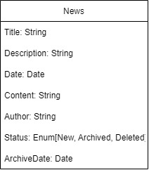

# Prueba técnica
A News Letter created with React 18 and bootstraped with React Prime. The News are served from a Mongo/Node/Express app using Socket.Io

The objective is to create a prototype of app which provides information about News to users.

The aplication has two views: New News and Archived News.
- New News View

- Archived News

The two frontend views consume all his data from the Socket server endpoints as we see in the frontend documentation. The server has a several endpoints dont used by the fronted like the Create article.

In this proptotype we use postman to test the endpoints:

- Emiters from clientSide//Listeners from serverSide
client:findNewNews
client:findArchivedNews
client:archiveArticle
client:deleteArticle

- Listeners from clientSide//Emiters from serverSide
server:findNewNews
server:findArchivedNews
server:createError
server:archiveError
server:deleteError

## Technical documentation
- [Frontend](./frontend/README.md)
- [Backend](./backend/README.md)

## Diagrama de casos de uso

## Esquema DB

